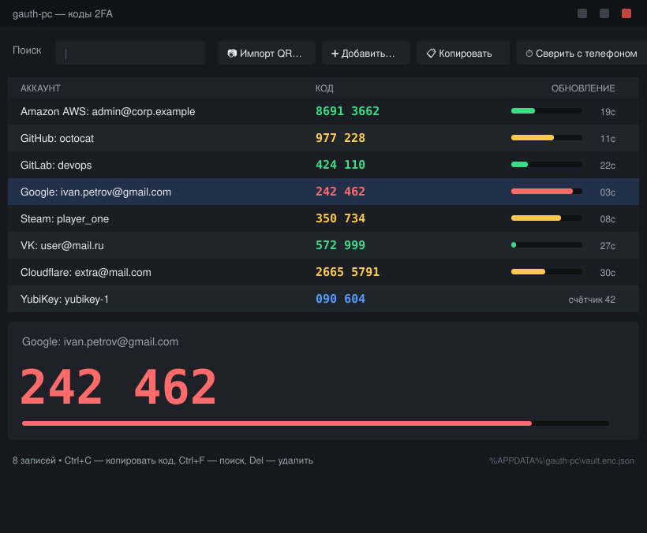

# gauth-pc — коды Google Authenticator на компьютере

> 📄 Короткая версия на одну страницу: **[QUICKSTART.md](QUICKSTART.md)**

Небольшая программа на Python, которая **переносит ваши 2FA-аккаунты из
Google Authenticator с телефона на ПК** и дальше показывает коды прямо
в терминале — с таймером, поиском и копированием в буфер обмена.

Коды считаются **локально по алгоритму TOTP (RFC 6238)** — точно так же, как
это делает приложение на телефоне. Интернет не используется вообще: программа
никуда ничего не отправляет.

```
АККАУНТ                         КОД        ОБНОВЛЕНИЕ
─────────────────────────────────────────────────────
Amazon AWS: admin@corp.example  4541 1796  ███████░░░░░░ 15с
GitHub: octocat                 102 689    ███████░░░░░░ 15с
Google: ivan.petrov@gmail.com   507 590    ███████░░░░░░ 15с
Steam: player_one               8BVYY      ███████░░░░░░ 15с
VK: user@mail.ru                938 872    ███████░░░░░░ 15с
YubiKey: yubikey-1              090 604    счётчик 42
```

---

## Как это работает (важно понять один раз)

Приложение-аутентификатор не «получает» коды с сервера. У него хранится
**секретный ключ** (base32-строка), который сервис выдал вам при включении 2FA.
Код = HMAC-хэш от этого ключа и текущего времени, поэтому любое устройство с
ключом и правильными часами выдаёт тот же код.

Значит, чтобы коды появились на ПК, нужно один раз перенести **секреты**.
Google Authenticator умеет их отдавать: меню → **«Перенос аккаунтов» →
«Экспорт аккаунтов»** показывает QR-код вида `otpauth-migration://…`, внутри
которого лежат все ваши ключи (формат — protobuf, публично не документирован,
но давно разобран сообществом). Программа его расшифровывает и сохраняет
в зашифрованный файл на ПК.

> ⚠️ **Этот QR = ключи от всех ваших аккаунтов.** Кто его увидит — сможет
> генерировать ваши коды. Импортируйте и **сразу удалите** фото/скриншот.
> Никому его не пересылайте и не кладите в облако.

> 📵 **Важно:** на Android экран экспорта защищён флагом `FLAG_SECURE` —
> **скриншот не делается** (получится чёрный кадр). Поэтому QR нужно
> **сфотографировать вторым устройством** (телефон, планшет) или вебкой
> ноутбука. Программа рассчитана именно на такие снимки: она сама выравнивает
> контраст, убирает зерно, увеличивает и пробует повороты.

Перенос не удаляет аккаунты с телефона: телефон и ПК будут показывать
одинаковые коды одновременно.

---

## Установка

Нужен Python 3.9+ (на Windows/macOS — с [python.org](https://www.python.org/downloads/),
при установке поставьте галочку **Add Python to PATH**).

**Вариант 1 — без установки (проще всего).** Скачайте/скопируйте эту папку
и запускайте через `run.cmd` (Windows) или `./run.sh` (Linux/macOS):

```bash
pip install -r requirements.txt      # или только: pip install cryptography
./run.sh codes                       # Linux/macOS
run.cmd codes                        # Windows
```

**Вариант 2 — установить как команду `gauth`:**

```bash
pip install .                        # из папки проекта
# или с доп. возможностями:
pip install ".[all]"                 # keyring + QR в терминале + чтение QR с картинки
gauth codes
```

Обязательная зависимость только одна — `cryptography`. Остальное по желанию:

| Пакет | Зачем |
|---|---|
| `keyring` | не спрашивать пароль при каждом запуске (хранит ключ в системном хранилище) |
| `zxing-cpp` + `pillow` | читать QR со скриншота (рекомендуемый) |
| `opencv-python` | то же, альтернативный бэкенд |
| `pyzbar` + `libzbar0` | то же, классика для Linux |
| `pyqrcode` + `pypng` | печатать QR в терминале (`gauth qr`) |
| `pyperclip` | буфер обмена, если нет `xclip`/`wl-copy` |
| `xclip` или `wl-clipboard` | буфер обмена в Linux (системный пакет) |

---

## Быстрый старт (5 шагов)

### 1. Создайте зашифрованное хранилище

```bash
gauth init
```

Программа попросит придумать пароль. Им шифруется файл с секретами
(scrypt + Fernet/AES). **Запомните его**: без пароля файл бесполезен,
а восстановить пароль невозможно.

Где лежит файл:

| ОС | Путь |
|---|---|
| Windows | `%APPDATA%\gauth-pc\vault.enc.json` |
| macOS | `~/Library/Application Support/gauth-pc/vault.enc.json` |
| Linux | `~/.config/gauth-pc/vault.enc.json` |

Переопределить: `--vault путь` или переменная окружения `GAUTH_VAULT`.

### 2. Сделайте экспорт в Google Authenticator на телефоне

1. Откройте Google Authenticator.
2. Нажмите **⋮** (три точки справа сверху) → **«Перенос аккаунтов»**
   (англ. *Transfer accounts*).
3. Выберите **«Экспорт аккаунтов»** (*Export accounts*).
4. Пройдите проверку: отпечаток / Face ID / PIN разблокировки.
5. Появится QR-код. Если аккаунтов много, QR будет несколько — экраны
   «1 из 3», «2 из 3»… Листайте и снимайте **каждый**.
6. Получите изображение QR на ПК. Способы по убыванию удобства:

   | Способ | Как |
   |---|---|
   | **Фото вторым устройством** (надёжнее всего) | Сфотографируйте экран телефоном/планшетом и перекиньте фото на ПК. Снимайте ровно, при хорошем свете, чтобы QR занимал почти весь кадр, без бликов и теней |
   | **Вебка ноутбука** | Windows: приложение «Камера» → фото. macOS: Photo Booth. Linux: `cheese`, `ffmpeg -f v4l2 -i /dev/video0 -frames:v 1 qr.jpg` |
   | **Скриншот** | На Android обычно **заблокирован** (чёрный кадр). Может сработать на iOS и на старых версиях приложения — попробуйте, но не рассчитывайте |
   | **Текстом, без фото** | Отсканируйте QR сторонним сканером на телефоне (он покажет длинную ссылку `otpauth-migration://…`), скопируйте текст и вставьте в программу через `--text` |

7. Перекиньте файлы на ПК (кабель, «Избранное» в мессенджере, почта) —
   и **удалите их из этих промежуточных мест сразу после импорта**.

> 💡 Если второго устройства нет вообще — не беда. Всегда остаётся ручной путь:
> зайдите в настройки 2FA нужного сервиса, выберите «Изменить способ» /
> «Ввести секретный ключ вручную» и добавьте ключ командой `gauth add`.

### 3. Импортируйте в программу

```bash
# из фото/скриншота (можно сразу несколько файлов, JPG и PNG)
gauth import ga --qr ~/Desktop/ga-qr-1.jpg ~/Desktop/ga-qr-2.jpg

# если фото не читается — отсканируйте QR любым сканером на телефоне
# и вставьте полученный текст ссылки:
gauth import ga --text 'otpauth-migration://offline?data=CM…&batch_size=1&batch_index=0&batch_id=…'

# посмотреть, что распозналось, но ничего не сохранять:
gauth import ga --qr shot.jpg --dry-run
```

Для чтения фото нужен один из бэкендов (`pip install zxing-cpp pillow` —
рекомендуется). Проверить, что доступно: `gauth doctor`.

Программа сама определит, все ли части экспорта вы отсканировали, и предупредит,
если не хватает «2 из 2». Повторный импорт не создаёт дубликаты.

### 4. Смотрите коды

```bash
gauth codes                 # живая таблица, обновляется сама, Ctrl+C — выход
gauth codes google          # только записи, подходящие под "google"
gauth codes --once          # напечатать один раз и выйти (для pipe/скриптов)
gauth list                  # список аккаунтов без кодов (с номерами)
```

### 5. Берите конкретный код

```bash
gauth get github            # крупно, с полоской таймера
gauth get github --bare     # только цифры — удобно вставлять в скрипты
gauth copy github           # скопировать в буфер (сам сотрётся через 25 с)
```

---

## Графический интерфейс (Windows-friendly)



*(макет; вживую коды и полоски обновляются 4 раза в секунду)*

Если терминал не хочется — есть обычное окно:

```bash
gauth gui                # или двойной клик по gauth-gui.cmd (Windows) / gauth-gui.sh
```

Что внутри:

* **Таблица кодов**, которая обновляется сама: зелёный — времени много,
  жёлтый — меньше трети периода, красный — меньше 5 секунд.
* **Крупный код** выбранного аккаунта и полоска обратного отсчёта.
* **Поиск** по названию (печатаете — список фильтруется на лету).
* **Кнопки**: «📷 Импорт QR…» (выбираете фото QR из Google Authenticator —
  программа распознаёт и добавляет), «➕ Добавить…», «📋 Копировать»,
  «⏱ Сверить с телефоном» (находит расхождение часов в секундах).
* **Горячие клавиши**: `Ctrl+C` — копировать код, `Ctrl+F` — поиск,
  `Esc` — сбросить поиск, `Del` — удалить запись, двойной клик — копировать.
* Меню **Файл**: импорт из фото / текстового файла / бэкапа Aegis, экспорт,
  смена пароля, «Показать папку с хранилищем».
* Меню **Действия**: «Следующий код» (если текущий вот-вот истечёт — копирует
  код следующего периода), «Показать QR записи» (перенос на телефон),
  «Показывать секреты».
* Меню **Справка**: пошаговая инструкция по переносу с телефона, диагностика
  (часы, установленные модули).

При первом запуске окно само предложит создать хранилище и задать пароль.

**Если окно не открывается** — скорее всего, в Python нет tkinter:

* **Windows:** запустите установщик Python с python.org → *Modify* → убедитесь,
  что отмечен **tcl/tk and IDLE**. (В Microsoft Store-сборке он обычно есть.)
* **Linux:** `sudo apt install python3-tk`
* **macOS:** используйте сборку с python.org или `brew install python-tk`

Терминальный режим при этом продолжает работать: `gauth codes`.

**Окно поверх всех окон (Windows).** Чтобы держать коды рядом с браузером:

```powershell
powershell -ExecutionPolicy Bypass -File .\run-live-codes.ps1            # терминальное окно
powershell -ExecutionPolicy Bypass -File .\run-live-codes.ps1 -Filter github
```

Либо создайте ярлык на `gauth-gui.cmd` и в свойствах ярлыка уберите окно
консоли (запуск через `py -3w`).

---

## Все команды

| Команда | Что делает |
|---|---|
| `init` | создать зашифрованное хранилище (`--force` — пересоздать) |
| `import ga` | импорт из Google Authenticator: `--qr файл.png`, `--text '…'`, `--file f.txt`, `--dry-run`, `--force` |
| `import text файл` | массовый импорт: по строке `otpauth://…` **или** `secret<TAB>имя<TAB>эмитент` (`-` = stdin) |
| `import aegis файл` | импорт из бэкапа Aegis / 2FAS (JSON, в т.ч. зашифрованного) |
| `add` | добавить аккаунт вручную: `--name --issuer --secret --digits --period --algo --steam --note` |
| `edit` | изменить запись: `gauth edit cloudflare --note "рабочий" -y` |
| `rm` | удалить запись: `gauth rm yubikey -y` |
| `codes` / `show` | живая таблица кодов (`--once`, `--index N`, `--show-secret`) |
| `list` / `ls` | список записей (`--json`, `--show-secret`) |
| `get` | один код (`--bare`, `--wait 5`, `--index`, `--bump` для HOTP) |
| `copy` | код в буфер обмена (`--wipe 25`, `--no-wipe`) |
| `check` | сверить код с телефоном и найти рассинхрон часов |
| `gen` | сгенерировать новый секрет и QR/ссылку для сайта (`--add` — сразу сохранить) |
| `qr` | напечатать QR записи в терминале (`--url`, `--save out.png`) — перенос обратно на телефон |
| `gui` | графическое окно с кодами (см. раздел выше) |
| `export` | выгрузить в `json` / `aegis` / `uris` (`--no-secrets` — без ключей) |
| `passwd` | сменить пароль хранилища (перезашифрует файл) |
| `info` | сводка: сколько записей, какие сервисы, параметры шифрования |
| `doctor` | диагностика: зависимости, права файла, проверка часов |

Общие флаги у всех команд: `--vault путь`, `--password …`, `--no-cache`,
`--key-from-stdin`.

### Поиск

Запрос сравнивается с эмитентом и именем: точное совпадение > префикс >
подстрока > «буквы по порядку». Примеры: `google`, `gh`, `octocat`,
`admin corp`, `vk`. Если подходит несколько записей, программа покажет их
и возьмёт первую (или спросит номер). Точный выбор — `--index N` (номера из
`gauth list`).

---

## Автоматизация

Код можно получить из любого скрипта:

```bash
CODE=$(gauth get github --bare)
curl -H "X-2FA-Code: $CODE" https://example.com/login
```

```python
# Python: можно вообще без CLI — импортировать пакет
from gauth.vault import Vault
from gauth import totp

v = Vault.open(password="мой-пароль")
e = v.search("github")[0]
print(totp.entry_code(e).value)          # текущий код
print(totp.entry_code(e, drift=1).value) # следующий
```

Пароль для автоматизации (чтобы не хранить его в истории команд):

```bash
echo 'мой-пароль' > ~/.gauth-pass && chmod 600 ~/.gauth-pass
export GAUTH_PASSWORD_FILE=~/.gauth-pass
gauth codes --once
```

Также работают `GAUTH_PASSWORD` (переменная окружения) и `--key-from-stdin`
(пароль приходит в stdin).

Windows PowerShell:

```powershell
$env:GAUTH_PASSWORD_FILE = "$HOME\.gauth-pass"
$code = (& gauth get github --bare)
```

---

## Безопасность

Что сделано:

* Секреты лежат в **одном зашифрованном файле**: `scrypt(n=2¹⁵, r=8, p=1)` →
  ключ → **Fernet** (AES-128-CBC + HMAC-SHA256, защита от подмены).
* Файл создаётся с правами **0600**, запись атомарная (через временный файл).
* Пароль вводится скрыто (`getpass`), в аргументах командной строки его лучше
  не светить — используйте `GAUTH_PASSWORD_FILE`.
* Копирование в буфер обмена **автоматически стирается** через 25 секунд
  (`copy --wipe 15`, отключается `--no-wipe`), причём стирается только если вы
  не скопировали что-то другое.
* Программа **не ходит в сеть**: ни телеметрии, ни обновлений, ни отправки кодов.
* `export` с секретами пишет файл с правами 0600 и предупреждает в stderr.

Чего делать **не стоит**:

* Не храните скриншот QR из Google Authenticator — удалите сразу после импорта.
* Не кладите `vault.enc.json` и тем более `export --out` в облако/репозиторий.
  Если очень нужен бэкап — храните его в зашифрованном контейнере (VeraCrypt,
  запароленный архив) или в менеджере паролей как вложение.
* Не запускайте `gauth` на чужом/заражённом компьютере: тот, кто читает ваш
  vault-файл и знает пароль, получает коды.
* Помните про **резервные коды** сервисов: если потеряете и телефон, и ПК,
  войти помогут только они.

Что даёт перенос на ПК: вам больше не нужен телефон под рукой, коды можно
вставлять в скрипты и держать окно поверх браузера. Что это стоит: теперь
секреты лежат ещё и на компьютере, поэтому пароль хранилища и шифрование диска
(BitLocker/FileVault/LUKS) — обязательны.

---

## Решение проблем

**«Не удалось прочитать QR из файла» / «не установлен ни один бэкенд»**
Установите один из: `pip install zxing-cpp pillow`, `pip install opencv-python`,
`pip install pyzbar pillow` (в Linux дополнительно `sudo apt install libzbar0`).
Проверьте, что доступно: `gauth doctor`.

**«Не удалось сделать скриншот» / чёрный кадр на экране экспорта**
Так и задумано: Android помечает экран экспорта как защищённый (`FLAG_SECURE`).
Сфотографируйте QR вторым телефоном или вебкой ноутбука — программа такие снимки
читает. Либо отсканируйте QR сторонним сканером и вставьте текст через `--text`.

**QR не распознаётся, хотя бэкенд установлен**
Программа уже пробует ~20 вариантов предобработки (масштаб, контраст, порог Отсу,
медианный фильтр, повороты). Если всё равно не вышло — переснимите: QR должен
занимать почти весь кадр, фокус резкий, без бликов и завала. Полезно также
обрезать лишнее вокруг QR. Проверено на синтетических «фото экрана» с низким
контрастом, зерном, мылом, наклоном и поворотом на 90° — читаются все.
Запасной путь всегда есть: `gauth import ga --text '…'`.

**Google Authenticator не показывает «Экспорт аккаунтов»**
Нужна версия приложения с меню «Перенос аккаунтов». Обновите его в
Play Market / App Store. На некоторых сборках пункт называется
«Transfer accounts» → «Export accounts».

**Аккаунтов много, QR несколько**
Экспорт режется на части («1 из 3», «2 из 3»…). Сфотографируйте/снимите все и
передайте разом: `gauth import ga --qr 1.png 2.png 3.png`. Программа скажет,
если какой-то части не хватает.

**Код на ПК не совпадает с телефоном / сайт не принимает код**
Почти всегда — часы. Выполните `gauth check google`, введите код с телефона,
и программа посчитает расхождение в секундах и подскажет, как включить
синхронизацию времени в вашей ОС. Дополнительно: `gauth doctor` показывает
локальное время и самопроверку.

**«Неверный пароль»**
Пароль восстановить нельзя — файл не расшифровать без него. Если записи ещё
есть на телефоне, создайте хранилище заново (`gauth init --force`) и повторите
импорт. Если включали `keyring`, пароль мог закэшироваться в системном
хранилище ключей — попробуйте запустить без `--no-cache`.

**«keyring недоступен — пароль придётся вводить при каждом запуске»**
`pip install keyring` (в Linux может понадобиться активный демон:
`gnome-keyring` / `kwallet`, иначе используйте `GAUTH_PASSWORD_FILE`).

**Нужно включить 2FA на новом сервисе, а телефона под рукой нет**
`gauth gen --name me@mail.com --issuer GitHub --qr --add` — создаст новый ключ,
покажет QR (его сканирует сайт) и сразу сохранит запись в хранилище. Если сайт
просит «ввести ключ вручную» — скопируйте напечатанный base32-секрет.

**Коды Steam**
Steam использует собственный формат (5 символов, буквы+цифры). Добавьте так:
`gauth add --name player_one --issuer Steam --secret XXXX --steam`.

**HOTP (счётчики, например YubiKey)**
Такие коды не зависят от времени и «сдвигаются» после использования:
`gauth get yubikey --bump` покажет код следующего счётчика и сохранит его.
Учтите: телефон и ПК считают счётчики независимо — они могут разойтись.

**Экспорт из Google Authenticator не содержит период 60 секунд**
В протоколе `otpauth-migration` нет поля периода, поэтому для всех TOTP
ставится 30 секунд (Google Authenticator всегда использует 30). Если сервис
выдал вам 60-секундный токен (обычно это видно в его настройках), поправьте:
`gauth edit имя --period 60`.

---

## Структура проекта

```
README.md / QUICKSTART.md    # подробное руководство / шпаргалка на страницу
LICENSE                      # MIT
gauth.py                     # точка входа (python gauth.py …)
run.sh / run.cmd             # запуск без установки (Linux/macOS / Windows)
gauth-gui.sh / gauth-gui.cmd # сразу открыть графическое окно
run-live-codes.ps1           # Windows: терминальное окно с кодами поверх всех окон
gauth/
  cli.py                     # командная строка, все подкоманды
  totp.py                    # TOTP/HOTP/Steam Guard, RFC 6238
  base32x.py                 # устойчивое декодирование base32/hex-секретов
  migration.py               # парсер otpauth-migration:// (protobuf вручную)
  qr.py                      # чтение QR с картинки (zxing-cpp / OpenCV / pyzbar)
  qr_display.py              # печать QR в терминале и otpauth:// ссылки
  vault.py                   # шифрованное хранилище (scrypt + Fernet)
  clipboard.py               # буфер обмена + автоочистка
  tui.py                     # живая таблица, цвета, прогресс-бары
  gui.py                     # графическое окно (tkinter)
tests/
  test_gauth.py              # 19 тестов: векторы RFC 4226/6238, protobuf, vault, QR
  test_gui.py                # 4 теста GUI: логика строк, жизненный цикл окна,
                             #   «проклик» всех кнопок, импорт из фото QR
                             #   (работают headless на моке tkinter)
  make_fake_ga_export.py     # генератор тестовых QR «как из Google Authenticator»
  make_fixtures.py           # генератор фикстур: скриншот + «фото экрана»
  smoke.sh                   # сквозной тест CLI (init → import → codes → export)
  fixtures/                  # QR для проверки импорта, в т.ч. шумные фото
```

### Тесты

```bash
python3 tests/make_fixtures.py   # (пере)создать фикстуры с QR
python3 tests/test_gauth.py      # 19 тестов, свой раннер без pytest
python3 tests/test_gui.py        # тесты GUI (работают даже без tkinter в системе)
python3 -m pytest -q             # всё вместе через pytest (23 теста)
bash tests/smoke.sh              # сквозной прогон всех команд CLI
```

Тесты чтения QR автоматически пропускаются, если не установлен ни один
бэкенд распознавания.

Проверяются в том числе **официальные векторы RFC 6238** (SHA1/SHA256/SHA512,
6 и 8 цифр) и **RFC 4226 Appendix D** (HOTP), включая промежуточные значения
HMAC — то есть коды совпадают с эталоном и с Google Authenticator бит в бит.

---

## Альтернативы

* **Aegis Authenticator** (Android, open source) — удобнее для переноса на ПК:
  умеет делать резервные копии в JSON (в т.ч. зашифрованные), а эта программа
  их импортирует: `gauth import aegis backup.json`. Можно один раз переехать
  с Google Authenticator на Aegis и дальше жить с нормальными бэкапами.
* **2FAS / Raivo / FreeOTP** — отдают обычные `otpauth://` ссылки, их понимает
  `gauth import text`.
* **Менеджеры паролей** (Bitwarden, 1Password, KeePassXC + плагин) — хранят
  TOTP рядом с паролями. Удобно, но коды живут в облаке/сейфе менеджера.
* Готовые CLI: `oathtool`, `pass-otp`, `pyauthenticator`. Эта программа
  отличается тем, что умеет именно **массовый импорт из Google Authenticator**
  и показывает живую таблицу всех кодов сразу.

Отдельно про **синхронизацию Google Authenticator**: с 2023 года приложение умеет
хранить коды в вашем Google-аккаунте и показывать их на других **телефонах**
(при входе тем же аккаунтом). На компьютер эта синхронизация не распространяется —
поэтому для ПК всё равно нужен перенос секретов, то есть эта программа.

---

## Лицензия

MIT. Программа предоставляется «как есть»; автор не несёт ответственности за
утрату доступа к аккаунтам. Перед переносом убедитесь, что у вас есть
резервные коды 2FA от важных сервисов.
